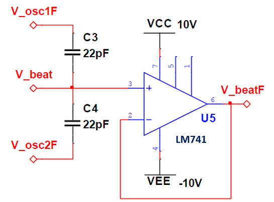

# Theremin

A **Theremin** is a unique electronic instrument—originating in the 1920s—that is played without any physical contact. By moving one’s hand near metal antennas, the instrument senses changes in capacitance to continuously modulate pitch and volume. In our simplified design, we focus solely on pitch control using a single antenna: the hand’s proximity alters a tuned LC circuit, producing a variable oscillator frequency. Mixing this oscillator with a fixed reference yields an audible beat frequency, which is then demodulated, amplified, filtered, and finally driven into a speaker.

  

> **Figure 1.** *Overall block diagram of the Theremin, illustrating (1) Oscillator stage, (2) Envelope detection, (3) Amplification, and (4) Active low-pass filtering before the speaker driver.*

---

## Table of Contents

1. [Overview](#overview)  
2. [Key Components](#key-components)  
3. [Circuit Blocks](#circuit-blocks)  
   - [1. Oscillator Pair](#1-oscillator-pair)  
   - [2. Envelope Detector](#2-envelope-detector)  
   - [3. Non-Inverting Amplifier](#3-non-inverting-amplifier)  
   - [4. Active Low-Pass Filter](#4-active-low-pass-filter)  
   - [5. Antenna & LC Tank](#5-antenna--lc-tank)  
   - [6. Speaker Driver & Output](#6-speaker-driver--output)  
4. [Materials & Schematic Files](#materials--schematic-files)  
5. [Construction & Calibration](#construction--calibration)  
6. [Operation Instructions](#operation-instructions)  

---

## Overview

This project implements a **single-antenna Theremin** that allows pitch control through capacitance changes detected by a user’s hand. Unlike commercial Theremins, which have separate volume and pitch antennas, our version uses only one antenna (for pitch). Instead of sinusoidal oscillators, both our fixed and variable oscillators generate square waves (via LM311 comparators), which simplifies the design but necessitates extra filtering to remove harmonics. The following blocks comprise the signal chain:

1. **Oscillator Block**: Two LM311 comparator‐based oscillators (fixed + variable).  
2. **Beat Frequency Generation**: AC-coupling of both oscillator outputs to create a low-frequency beat note.  
3. **Envelope Detection**: A diode + RC network tracks the amplitude envelope of the beat.  
4. **Amplification**: LM741 non-inverting amplifier to boost the envelope signal.  
5. **Active Low-Pass Filter**: LM741 op-amp configured to remove high-frequency noise (cutoff ≈ 7.2 kHz).  
6. **Speaker Driver**: Standard speaker driver module to power a 12 V speaker.

---

## Key Components

- **LM311 Differential Comparator:** produces square-wave oscillations.  
- **LM741 Op-Amp:** configured as a non‐inverting amplifier for the envelope signal as well as used as a high‐impedance buffer and in the active low-pass filter.
- **Diode (e.g., 1N4148) + RC Network:** serves as a passive envelope detector / half-wave rectifier.  
- **4 × 10 mH Inductors (total 40 mH):** form the inductor portion of the LC tank, coupled to the antenna’s capacitance (~1.33 pF).  
- **Variable Potentiometer:** for fine‐tuning oscillator frequency and calibration.  
- **Commercial Speaker Driver Module:** to amplify the final filtered signal sufficiently for a 12 V speaker.

---

## Circuit Blocks

### 1. Oscillator Pair

  
  

- **Fixed-Frequency Oscillator (LM311 + LM741 Buffer):**  
  - LM311 configured with resistors and a timing capacitor to generate a stable reference frequency (e.g., ~200 kHz).  
  - Output is AC-coupled into an LM741 buffer to present a low-impedance square wave.

- **Variable-Frequency Oscillator (LM311 + LM741 Buffer):**  
  - Similar LM311 topology, but the timing capacitance is formed by a potentiometer, the set of inductors, and the antenna.  
  - Hand proximity to the antenna changes capacitance, thus shifting the oscillation frequency.  
  - Outgoing square wave is also buffered by an LM741.

  

- **Beat Frequency Generation:**  
  - AC-coupling capacitors from each buffer stage sum the square waves.  
  - The difference between fixed and variable frequencies appears as a low-frequency “beat” signal.  
  - This beat is fed into another LM741 buffer to isolate it from loading effects.

---

### 2. Envelope Detector

  

- **Diode + RC Network:**  
  - The buffered beat frequency is half‐wave rectified by a diode.  
  - A parallel R–C combination filters out the carrier, leaving the amplitude envelope.  
  - A coupling capacitor removes DC offset, while a pull-up/pull-down resistor network prevents floating nodes and stops spurious noise.

---

### 3. Non-Inverting Amplifier

  

- **LM741 Op-Amp Stage:**  
  - Configured in a non-inverting arrangement to boost the envelope signal to a level appropriate for filtering.  
  - Gain is set by the resistor ratio (RF / Rin), enabling adjustable amplification.

---

### 4. Active Low-Pass Filter

  

- **LM741 in 2nd-Order Low-Pass Configuration:**  
  - Designed with a cutoff frequency around 7.2 kHz to eliminate high-frequency artifacts from square-wave oscillators and the envelope detection stage.  
  - This ensures that only the smooth, audio-range signal (0–7 kHz) remains for the speaker driver.

---

### 5. Antenna & LC Tank

- **4 × 10 mH Inductors (40 mH Total):**  
  - Wired in series, positioned near the Theremin’s metal antenna.  
  - The combined inductance forms an LC resonator with the antenna’s capacitance (~1.33 pF).  
  - As a hand approaches the antenna, the effective Cantenna changes, causing the variable oscillator’s frequency to shift.

---

### 6. Speaker Driver & Output

- **Commercial Speaker Driver Module:**  
  - Accepts the low-power, filtered audio envelope (~5 V p-p) and boosts it to drive a standard 12 V speaker.  
  - Ensures adequate volume and impedance matching.

---

## Materials & Schematic Files

- **Integrated Circuits:**  
  - 2× LM311 Differential Comparators  
  - 2× LM741 JFET Input Op-Amps  
  - 1× LM741 General-Purpose Op-Amp  

- **Passives & Electromechanical:**  
  - 4× 10 mH Inductors (total 40 mH)  
  - Potentiometer (100 kΩ) for variable oscillator tuning  
  - Assorted resistors, capacitors (AC-coupling, timing, RC envelope)  
  - Diode (e.g., 1N4148)  
  - Protoboard / PCB and wiring harness  
  - Metal antenna (≈ 1.33 pF measured capacitance)  

- **Audio Output:**  
  - Speaker Driver Module (12 V input)  
  - 12 V, 8 Ω Speaker  

- **Schematic PNGs:**  
  - `Main.png` (overall block layout)  
  - `fixed_freq_oscillator.png`  
  - `variable_freq_oscillator.png`  
  - `beats_generator.png`  
  - `envelope_detector.png`  
  - `non_inverting_amp.png`  
  - `active_lowpass_filter.png`  
  - `floating_noise_eliminator.png` (optional sub-block to suppress stray RF noise)  

---

## Construction & Calibration

1. **Build Each Block Separately:**  
   - **Oscillators:** Solder LM311 comparator circuits on a protoboard; verify square-wave output using an oscilloscope.  
   - **Buffers:** Connect outputs to LM741 buffers; ensure clean waveforms.  
   - **Envelope Detector:** Assemble diode and RC network; confirm envelope tracking on beat signal.  
   - **Amplifier & Filter:** Wire LM741 amplifier and LM741 low-pass filter; adjust gain and cutoff.  
2. **Antenna & LC Tank Setup:**  
   - Mount the four inductors in series on a small PCB or perfboard.  
   - Place the metal antenna above the inductor series; measure the total Cantenna (~1.33 pF) using an LCR meter.  
3. **Integration:**  
   - Tie the variable oscillator’s timing node to the LC tank (inductor + antenna).  
   - AC-couple both oscillators’ buffered outputs to the beat generator.  
   - Connect the beat output→ envelope detector→ amplifier→ low-pass filter→ speaker driver.  
4. **Tuning:**  
   - Adjust potentiometer on the variable oscillator so that, with no hand present, the beat frequency is in the audible range (e.g., ~1 kHz).  
   - Fine-tune resistor/capacitor values in the envelope detector and amplifier to eliminate distortion.  
   - Verify the low-pass filter cutoff by sweeping a sine wave (7 kHz) and confirming attenuation above 7.2 kHz.

---

## Operation Instructions

1. **Power Up:**  
   - Supply ±12 V to all op-amps (LM741, LM741) and LM311 comparators as per their datasheets.  
   - Provide 12 V to the speaker driver module.  
2. **Stand in Front of Antenna:**  
   - With the Theremin powered, you should hear a constant tone (beat frequency) when no hand is near the antenna.  
   - Slowly move your hand toward the antenna—observe the pitch ascend as capacitance increases, lowering the variable oscillator’s frequency closer to the fixed oscillator.  
3. **Play Melodies:**  
   - Use smooth hand motions to create continuous pitch slides.  
   - The envelope detector + amplifier chain will remove the high-frequency carrier, so you hear only the slowly varying pitch.  
4. **Adjustments:**  
   - If the volume is too low or too harsh, tweak the LM741 gain or adjust the low-pass filter’s resistor values.  
   - Recalibrate the oscillator potentiometer to center the playable range around mid-air.

